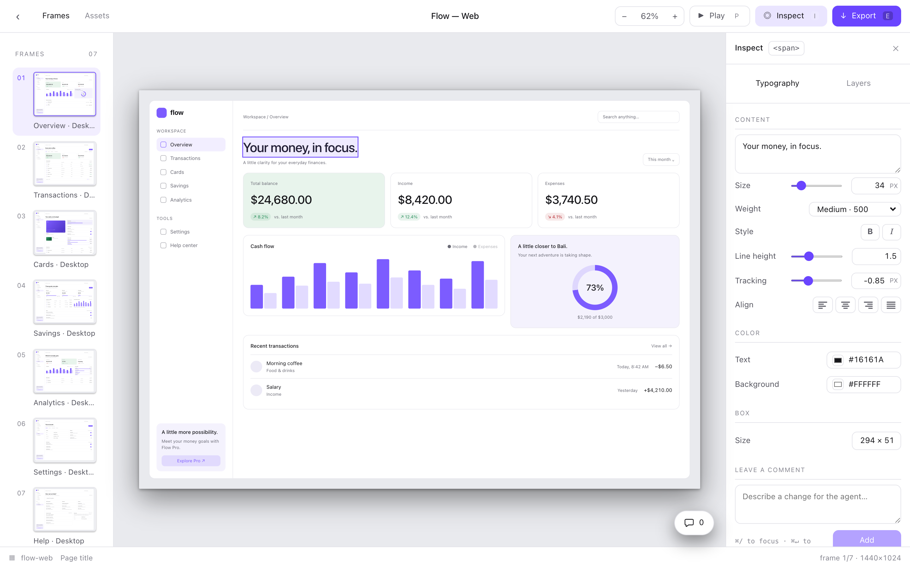
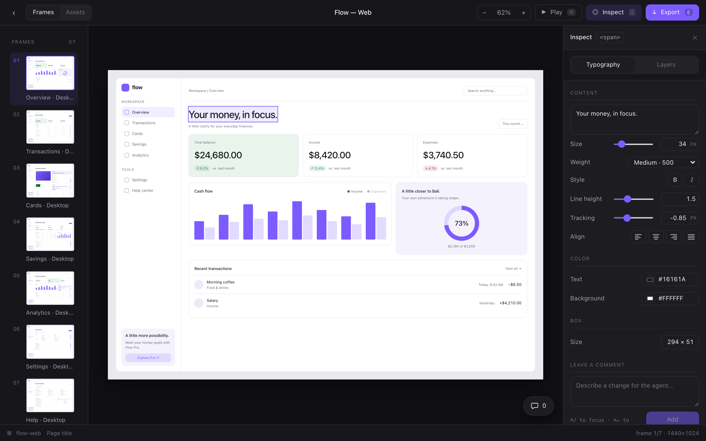
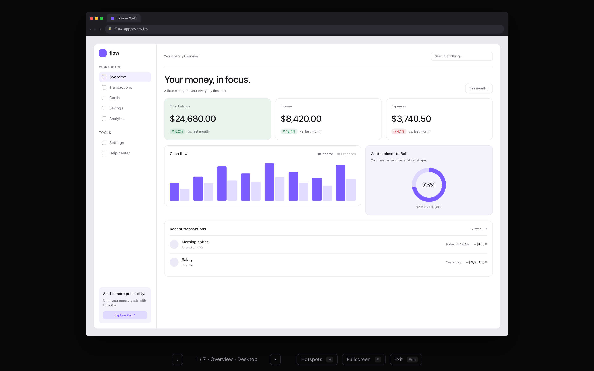
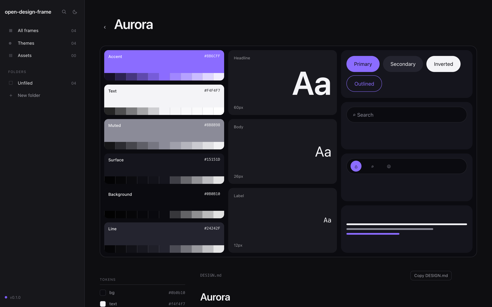
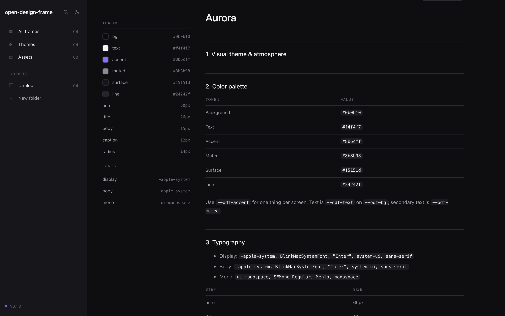
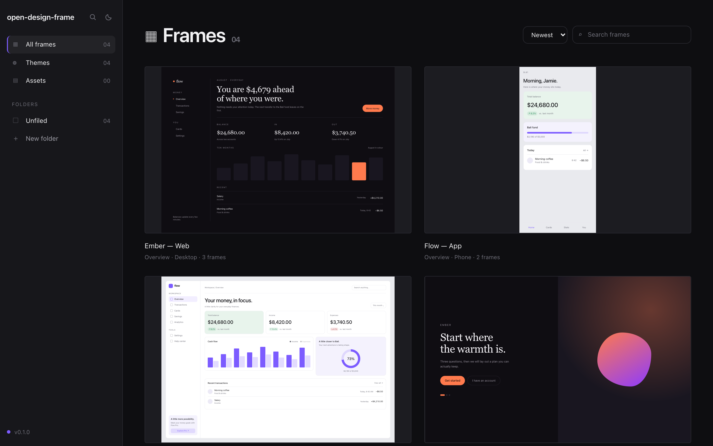

<picture>
  <source media="(prefers-color-scheme: dark)" srcset=".github/assets/preview-dark.png">
  
</picture>

# open-design-frame

[](https://github.com/simonliu-ai-product/open-design-frame/actions/workflows/ci.yml)
[](https://www.npmjs.com/package/@open-design-frame/core)
[](https://github.com/simonliu-ai-product/open-design-frame/stargazers)
[](https://opensource.org/licenses/MIT)

**English** · [繁體中文](README.zh-TW.md)

**Design frames, written as components.** A frame is a fixed-size artboard — a desktop screen, a phone screen, a poster. Your agent writes it in TSX, the canvas draws it at true size, and the inspector edits it by rewriting the file you wrote.

The third of a family: [open-doc](https://github.com/simonliu-ai-product/open-doc) is documents and [open-slide](https://github.com/1weiho/open-slide) is decks. A document is a stack of A4 sheets, a deck is a 16:9 canvas — a design has no fixed medium, so the **size travels with the frame**.

```bash
pnpm add -D @open-design-frame/core
```

<video src="https://github.com/simonliu-ai-product/open-design-frame/raw/main/media/intro.mp4" controls muted playsinline width="100%"></video>

<sub>Thirty seconds, nothing staged: an agent creates a frame over MCP, the canvas edits its own source, the player follows the links the frame declares. <a href="media/intro.mp4">Download the file</a> if it does not play here.</sub>

## Why

Design tools keep the design and the code in two places, and the two drift. Handing an agent a Figma file does not help either — it cannot open one. open-design-frame makes the design a React component: the agent can write it, git can diff it, and the canvas shows exactly what will ship, because it *is* what will ship.

## Highlights

### 🖼️ A frame is a component, at true size

`frames/<id>/index.tsx` default-exports an array of frames, each carrying its own size — `SIZES.DESKTOP` (1440 × 1024), `LAPTOP`, `TABLET`, `PHONE`, `SQUARE`, or any `{ width, height }`. The canvas scales the container, never the contents, so 16px type is 16px whatever the zoom says. The home cover, the rail thumbnail, and the canvas are the same renderer at three scales — a thumbnail that disagrees with what opens is not a state this can reach.

### 🖱️ Click the canvas, and the source changes



<sub>Click an element on the canvas; the inspector fills with what the browser actually resolved, and Save writes it back into the TSX.</sub>

Click anything — not just what you wrapped in a `<Layer>`. Changing a value applies to the canvas immediately *and* stages it; Save rewrites the frame's own source. An element styled from a shared constant is refused with the reason, because changing that constant would restyle everything else using it.

### ▶️ Play it like a site



<sub>Play mode: the frame inside a simulated browser, following the links the frame itself declares.</sub>

`<Layer to="Transactions · Desktop">` says where a press goes. Play draws the frame inside a simulated browser — or a phone, by the frame's own width — and follows those links and nothing else. A press with nowhere to go flashes the hotspots rather than swallowing it.

### 🎨 Themes carry a DESIGN.md



<sub>A theme sheet — colour ramps, type specimens and controls, every mark generated from the theme's own tokens.</sub>



<sub>The theme's DESIGN.md, rendered beside its tokens — with a button that copies the markdown for an agent.</sub>

A theme is a `DesignSystem` in `themes/<id>`, and its tokens become `--odf-*` variables. Beside them sits a [`DESIGN.md`](https://www.thisweb.dev/articles/design-md): atmosphere, spacing, component rules, do's and don'ts, and the prompt an agent should be handed — the half of a design system that tokens cannot hold. It is bundled into the build, not fetched, because a design system nobody can read once it ships is not one.

### 💬 Comments that live in the source

Leave a note on the selected element and it is written into the frame's own file as a JSX comment, beside the markup it is about. It survives a reload, travels in the commit, and disappears with the element it described — rather than pointing at a line that now says something else.

### 📦 One zip, a folder per format

Export writes a single zip with a folder per format: HTML that opens on its own (markup plus tokens, no stylesheet to ship beside it), PNG at 1×/2×/3×, SVG. Every frame is drawn on an off-screen stage at its own size, so the zoom you happen to be viewing at never reaches the file.

### 🔌 An MCP server, so any agent framework can drive it

`open-design-frame dev --mcp` mounts an MCP endpoint next to the canvas — 25 tools covering frames, one element at a time, comments, folders, themes, design documents, and assets. It is stateless Streamable HTTP, so a client just points at `http://localhost:5274/mcp` with no session handshake.

The tools and the browser share one implementation, so `write_frame` takes the revision you last read and refuses a stale write with `409` rather than overwriting whoever got there first. See [packages/mcp](packages/mcp).

### 🗂️ A workspace, not a file list



<sub>Every frame file as a card, with folders, search, and the themes and assets beside them.</sub>

Folders are labels, not directories — filing a frame moves no files, because the folder name is the id and the id is in the URL. Assets have two scopes, `frames/<id>/assets/` and the project's own, and the list says which frames mention each file, so an unused one is visible.

### 🚀 Deploy-friendly

`open-design-frame build` outputs a plain static site — deploy to Vercel, Cloudflare Pages, Netlify, or any static host.

## Get started

```bash
pnpm add -D @open-design-frame/core
open-design-frame dev
```

Open http://localhost:5274. From there, drive it through your agent — or edit `frames/<id>/index.tsx` directly.

| Command | What it does |
| --- | --- |
| `open-design-frame dev` | Canvas with hot reload (`--mcp` to mount the MCP endpoint, `--port`, `--host`) |
| `open-design-frame build` | Static site into `dist/` (`--out-dir` to change it) |

## The file contract

```tsx
// frames/welcome/index.tsx
import { type Frame, type FrameMeta, Layer, SIZES } from '@open-design-frame/core';
import aurora from '../../themes/aurora';

export const meta: FrameMeta = { title: 'Welcome' };
export const design = aurora;

const Welcome: Frame = () => (
  <Layer name="Hero" style={{ padding: 72 }}>
    <Layer name="Headline" kind="text" as="span" style={{ fontSize: 'var(--odf-size-hero)' }}>
      Start where the warmth is.
    </Layer>
  </Layer>
);

Welcome.frameName = 'Welcome · Desktop';
Welcome.size = SIZES.DESKTOP;

export default [Welcome];
```

`size` travels with the frame. `design` supplies the tokens. `<Layer name="…">` is what puts a piece of the frame in the inspector's tree — unwrapped markup renders the same, it just cannot be selected.

## Repo layout

pnpm + Turbo monorepo.

| Path | Description |
| --- | --- |
| [packages/core](packages/core) | `@open-design-frame/core` — runtime (canvas, rail, inspector, player, export, themes, assets), Vite plugins, and the `open-design-frame` dev/build CLI. |
| [packages/mcp](packages/mcp) | `@open-design-frame/mcp` — MCP server over Streamable HTTP. Opt-in; `open-design-frame dev --mcp` mounts it at `/mcp`. |
| [apps/demo](apps/demo) | Example workspace consuming `@open-design-frame/core` via `workspace:*`. Dogfood target. |
| [media](media) | The intro film, and the script that records it against a running dev server. |

## Development

```bash
pnpm install
pnpm dev        # runs the demo against the local @open-design-frame/core
pnpm build      # builds all packages
pnpm typecheck  # tsc across the graph
pnpm check      # biome (format + lint + organize imports)
pnpm test       # vitest
```

CI runs those, and then builds a frame from the packed tarball — the viewer ships as source, so what matters is whether the published package works, not whether the monorepo does.

## Contributing

Bug reports, feature requests, and pull requests are welcome. Run `pnpm check`, `pnpm typecheck`, and `pnpm test` before opening one; if you touch anything that ships, check the packaged build too — that is the job CI calls `packaged`.

## Credits

The architecture — virtual-module discovery, an `ops` layer shared by the dev server and the MCP endpoint, the viewer shipped as source — follows [open-doc](https://github.com/simonliu-ai-product/open-doc) and [open-slide](https://github.com/1weiho/open-slide) by [@1weiho](https://github.com/1weiho).

## License

MIT
